<!-- =======================
   Jorge Peraza — Profile README
   MonkeysCMS-style branding
======================= -->

  

<h1 align="center">🐒 Jorge Peraza</h1>

  <b>Software Engineer • Founder @ MonkeysCloud</b> 
  Building modular frameworks, AI-native platforms, and developer-first tooling.

  
  
  

  
  

---

## 🧠 Bio

I’m a software engineer with 18+ years of experience building scalable platforms and developer-friendly systems.  
I focus on **modular architecture**, **open-source ecosystems**, and **meaningful AI integration** — tools that make teams faster and products better.

---

## 💼 Investor Snapshot

**What I’m building**

- **MonkeysCMS**: an AI-native open CMS (content + SEO + automation) built on a modern modular foundation.
- **MonkeysLegion**: a modular PHP framework + production-ready skeleton for shipping apps fast with clean architecture.

**Why it matters**

- CMS market is massive, but legacy platforms are heavy and AI is bolted-on.
- MonkeysCMS is designed **AI-first** and **developer-first**, with an API-driven core and extensibility from day one.

**Looking for**

- Product/engineering partners, open-source contributors, and strategic investors aligned with developer tooling + AI-native platforms.

📩 Best contact: **LinkedIn** → https://www.linkedin.com/in/jorgeperaza/

---

## 🚀 Featured Projects

### 🧱 MonkeysLegion Skeleton (PHP app starter)

A production-ready PHP application skeleton built on **MonkeysLegion** for clean, scalable apps.  
👉 https://github.com/MonkeysCloud/MonkeysLegion-Skeleton

---

### 🗂 MonkeysCMS (AI-native Open CMS)

An **AI-native, open-source CMS** built on MonkeysLegion — API-first, automation-ready, extensible by design.  
👉 https://github.com/MonkeysCloud/MonkeysCMS

---

## ✍️ Latest Dev.to Articles

<!-- BLOG-POST-LIST:START -->
- [MonkeysLegion: Ship Production-Ready PHP in Minutes, Not Days 🚀](https://dev.to/yorchperaza/monkeyslegion-ship-production-ready-php-in-minutes-not-days-45jh)
- [🧠 MonkeysCMS: An AI-Native CMS Built on MonkeysLegion — Rethinking Content Platforms from the Core](https://dev.to/yorchperaza/monkeyscms-an-ai-native-cms-built-on-monkeyslegion-rethinking-content-platforms-from-the-core-3dpj)
- [MonkeysCMS + MonkeysAI: Building the First AI-Native Open CMS 🚀](https://dev.to/yorchperaza/monkeyscms-monkeysai-building-the-first-ai-native-open-cms-p23)
- [Build the CMS we always wanted: MonkeysCMS &lpar;contributors wanted&rpar;](https://dev.to/yorchperaza/build-the-cms-we-always-wanted-monkeyscms-contributors-wanted-4oed)
- [MonkeysLegion 1.0.8: From Side Project to Production-Ready PHP Ecosystem](https://dev.to/yorchperaza/monkeyslegion-108-from-side-project-to-production-ready-php-ecosystem-27j5)
<!-- BLOG-POST-LIST:END -->

---

## 📊 GitHub Stats

  

---

## 📈 Activity Graph

---

## 🤝 Let’s Build

If you're into **open source**, **clean architecture**, and **AI-native products**, let’s collaborate.  
Open an issue, submit a PR, or reach out on LinkedIn.
