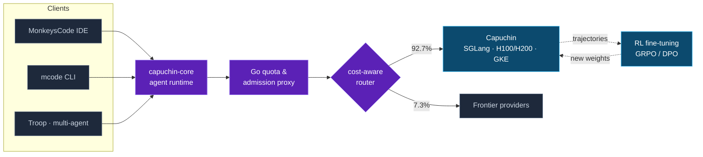

<!-- ============================================================
     Jorge "Yorch" Peraza — GitHub Profile README
     Staff / Founding Engineer · AI Platform & Developer Tools
============================================================= -->

  

  

  
  
  
  

---

## 🐒 About me

I build **AI products and the infrastructure they run on** — from the agent runtime a developer touches, down to the GPU node serving the model.

Founder & Principal Engineer at **MonkeysCloud**, where I created **MonkeysCode** (an agentic coding IDE) and **Capuchin** (the in‑house coding model behind it). Twenty years of production systems across Python, TypeScript, Go and PHP, with hands‑on depth in **GPU model serving**, **quota & admission control**, and **RL fine‑tuning**. I'm most at home owning an ambiguous product from zero to production — and running it afterward.

<table>
  <tr>
    <td align="center" width="25%"><h2>92.7%</h2>production requests served on in‑house infra</td>
    <td align="center" width="25%"><h2>~6×</h2>target cost advantage vs. reseller‑model competitors</td>
    <td align="center" width="25%"><h2>~7,000</h2>concurrent users per GPU node</td>
    <td align="center" width="25%"><h2>20+</h2>years shipping production systems</td>
  </tr>
</table>

---

## 🚀 Flagship — MonkeysCode × Capuchin

> An agentic coding IDE competing with Cursor and Claude Code, powered by a model and serving stack I designed, sized and operate.

<table>
  <tr>
    <td width="50%" valign="top">
      <h4>🧠 Product surface</h4>
      <ul>
        <li><b>capuchin-core</b> — shared TypeScript agent runtime: tool‑calling loops, verification layer</li>
        <li><b>mcode CLI</b> — TypeScript / Ink, compiled with Bun</li>
        <li><b>Troop</b> — multi‑agent desktop orchestrator (Electron)</li>
        <li><b>Org API keys</b> — HMAC‑SHA‑256, audited, rate‑limited, for CI/CD & integrations</li>
      </ul>
    </td>
    <td width="50%" valign="top">
      <h4>⚙️ Infrastructure</h4>
      <ul>
        <li><b>GPU serving</b> — committed H100/H200 on GKE with SGLang, cold‑start elimination</li>
        <li><b>Go quota & admission proxy</b> — dual‑pool per‑model quotas, rolling burst + weekly governors, 9 packaging tiers</li>
        <li><b>Cost‑aware routing</b> — two‑mode model (fast completion / budgeted reasoning) with task‑based routing</li>
        <li><b>RL pipeline</b> — GRPO/DPO on real usage trajectories, rewarded by test‑pass & edit‑persistence</li>
      </ul>
    </td>
  </tr>
</table>

```mermaid
flowchart LR
    subgraph Clients
        IDE[MonkeysCode IDE]
        CLI[mcode CLI]
        TROOP[Troop · multi-agent]
    end

    IDE & CLI & TROOP --> CORE[capuchin-core<br/>agent runtime]
    CORE --> PROXY[Go quota &<br/>admission proxy]
    PROXY --> ROUTER{cost-aware<br/>router}
    ROUTER -->|92.7%| CAP[Capuchin<br/>SGLang · H100/H200 · GKE]
    ROUTER -->|7.3%| FRONTIER[Frontier providers]
    CAP -. trajectories .-> RL[RL fine-tuning<br/>GRPO / DPO]
    RL -. new weights .-> CAP

    classDef core fill:#5B21B6,stroke:#A78BFA,color:#fff
    classDef infra fill:#0C4A6E,stroke:#38BDF8,color:#fff
    classDef ext fill:#1E293B,stroke:#64748B,color:#CBD5E1
    class CORE,PROXY,ROUTER core
    class CAP,RL infra
    class FRONTIER,IDE,CLI,TROOP ext
```

---

## 🧩 The MonkeysCloud ecosystem

|     | Project                | What it is                                                                                                              |
| :-: | :--------------------- | :---------------------------------------------------------------------------------------------------------------------- |
| 🐒  | **MonkeysCode**        | Agentic coding IDE, CLI and multi‑agent orchestrator                                                                    |
| 🧠  | **Capuchin**           | In‑house coding model + serving stack — fast & reasoning modes, automatic routing                                       |
| ⚡  | **MonkeysAI**          | Self‑hosted inference platform on open‑weight models (Llama, DeepSeek, large MoE) via vLLM, OpenAI‑compatible endpoints |
| 🛡️  | **MonkeysLegion**      | Modular PHP 8.4 framework — 29+ packages, PHPStan level 9, production‑ready skeleton                                    |
| 🔮  | **MonkeysLegion Apex** | AI orchestration for PHP 8.4+ — provider abstraction, model routing, fallback strategies                                |
| ☁️  | **MonkeysCloud**       | Developer platform — Git APIs, repo automation, provisioning, deploy triggers, CI/CD                                    |
| ✉️  | **MonkeysMail**        | Transactional email infrastructure — Postfix/OpenDKIM, Redis streams, tracking dashboard                                |

---

## 🛠️ Tech stack

<h4 align="center">AI / ML infrastructure</h4>

  
  
  
  
  
  
  
  
  
  

<h4 align="center">Languages</h4>

  

<h4 align="center">Cloud, infrastructure & data</h4>

  

<h4 align="center">Apps & frameworks</h4>

  
  

  
<b>Reliability & security</b>

   

- **Reliability** — p50/p95/p99 latency discipline, structured logging, metrics, health & startup probes, dashboards, alerting, capacity planning, incident triage, cost attribution
- **Security** — secrets management, access control, service isolation, TLS, zero‑trust patterns, audit trails, SOC 2 & GDPR readiness
- **Currently learning** — Rust 🦀

---

## 🧭 Experience

| Role                                  | Company                                                     | When           |
| :------------------------------------ | :---------------------------------------------------------- | :------------- |
| **Founder & Principal Engineer**      | MonkeysCloud · Denver, CO                                   | 2019 – present |
| Senior Full‑Stack / Platform Engineer | Tesla                                                       | 2023 – 2024    |
| Senior Symfony Developer, Full Stack  | Cidi Labs                                                   | 2021 – 2023    |
| Senior Software Engineer & Consultant | Enterprise projects · Costa Rica / US (incl. Gorilla Logic) | 2002 – 2021    |

🎓 Computer Software Engineering — ULACIT, Costa Rica

---

## 💬 Talk to me about

`LLM serving` · `GPU capacity planning` · `agentic runtimes` · `quota & admission control` · `RL fine‑tuning` · `modular PHP 8.4 architecture` · `developer platforms`

---

## 📊 GitHub activity

  
  

  

  

